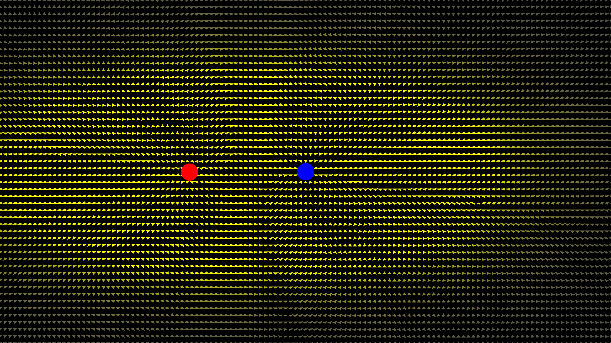

# 2D Electric Field Visualizer

A real-time interactive simulation of the electric field produced by two point charges, built in C++ with OpenGL. The simulation applies Coulomb's law and the principle of superposition to compute the field at 6,250 grid points every frame, rendering each as a directional arrow color mapped by magnitude.



---

## Physics

The electric field at any point in space due to a point charge is given by Coulomb's law:

**E = k * q / r² * r̂**

where `k` is Coulomb's constant (8.99 × 10⁹ N·m²/C²), `q` is the signed charge value, `r` is the distance from the charge to the field point, and `r̂` is the unit vector pointing from the charge to the field point.

For two charges, the total field at each point is computed by superposition. The contributions from the positive and negative charges are calculated independently and summed. The sign of `q` handles the direction automatically: positive charges produce fields that point away (repulsion), and negative charges produce fields that point toward (attraction).

Arrow color is mapped logarithmically from grey (weak field) to yellow (strong field), compressing the wide dynamic range of Coulomb's law into a visually useful scale.

---

## Features

- Real-time field computation across a 125 × 50 grid each frame
- Positive charge follows the cursor for interactive field exploration
- Color mapping reflects field magnitude using logarithmic normalization
- Instanced rendering sends all 6,250 arrows to the GPU in a single draw call
- Multi-threaded field calculation using OpenMP

---

## Dependencies

All dependencies are included in the repository.

- [GLFW](https://www.glfw.org/) — window creation and input handling
- [GLAD](https://glad.dav1d.de/) — OpenGL function loader
- OpenMP — CPU parallelism for field computation

---

## Project Structure

```
├── App.h          # App class declaration, structs, and constants
├── App.cpp        # Simulation logic, shader source, and rendering
├── main.cpp       # Entry point and render loop
├── Makefile       
├── include/       # GLFW and GLAD headers
├── src/           # GLAD source
└── lib/           # GLFW static library
```
